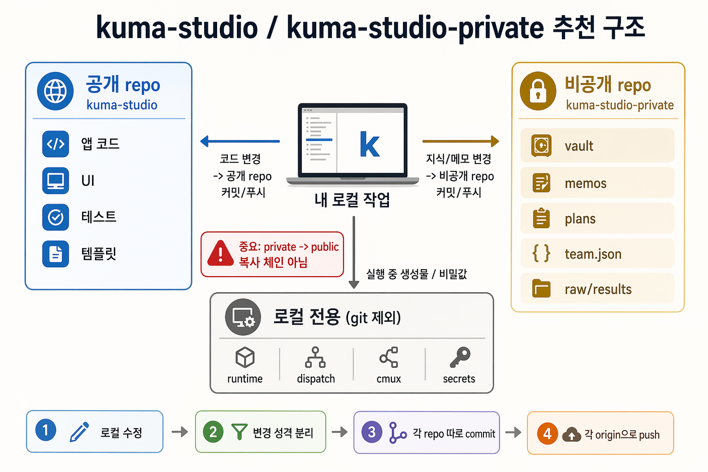

# Private Repo Model

Kuma Studio is a portable operator bundle. It works best with two Git
repositories plus one local-only runtime layer.



For the packaging terminology, see
[`distribution-model.md`](./distribution-model.md). This document owns only the
public/private/runtime split.

## Recommended split

- public repo: `kuma-studio`
  - app code
  - UI
  - reusable skills
  - tests
  - public docs and templates
- private repo: `kuma-studio-private`
  - `vault/`
  - `plans/`
  - `team.json`
- local-only runtime and secrets
  - `~/.kuma/runtime/`
  - `~/.kuma/dispatch/`
  - `~/.kuma/cmux/`
  - `~/.kuma/projects.json`
  - `.env*`, screenshots, caches, logs

## Important rule

`kuma-studio-private` is not an inbox that later gets copied into the public
repo.

Default to the private repo for canonical user knowledge. Treat local-only as a
strict exception for runtime, secrets, and re-creatable machine state.

The workflow is:

- code changes -> commit/push `kuma-studio`
- knowledge changes -> commit/push `kuma-studio-private`
- runtime/secrets -> do not commit

## Bootstrap once

From the public repo:

```bash
npm run kuma-private:bootstrap
npm run skill:doctor
```

Default behavior:

- creates a sibling `../kuma-studio-private`
- initializes Git if needed
- seeds `vault/`, `plans/`, and `team.json` from your existing `~/.kuma` data when the target is empty
- relinks `~/.kuma/vault`, `~/.kuma/plans`, and `~/.kuma/team.json` as symlinks into the private repo
- leaves `runtime`, `dispatch`, `cmux`, `projects.json`, and secrets outside the private repo

The bootstrap refuses to create `kuma-studio-private` inside the public repo.

## Connect the private remote

After bootstrap:

```bash
cd ../kuma-studio-private
git branch -M main
git remote add origin <your-private-github-remote>
git add .
git commit -m "Initialize private Kuma brain"
git push -u origin main
```

## Daily workflow

### 1. Product code or public docs changed

```bash
cd ../kuma-studio
git add .
git commit -m "..."
git push
```

### 2. Vault, memos, plans, or team config changed

```bash
cd ../kuma-studio-private
git add vault plans team.json
git commit -m "..."
git push
```

### 3. Runtime or secret files changed

Do nothing in Git. Keep them machine-local.

## Why this model

- SSoT: code lives in the public repo, private knowledge lives in the private repo
- SRP: each repo owns one kind of truth
- No Silent Fallback: the public repo does not quietly become a second owner of private brain data
- Safer open source hygiene: docs and code stay public, real operator data stays private
